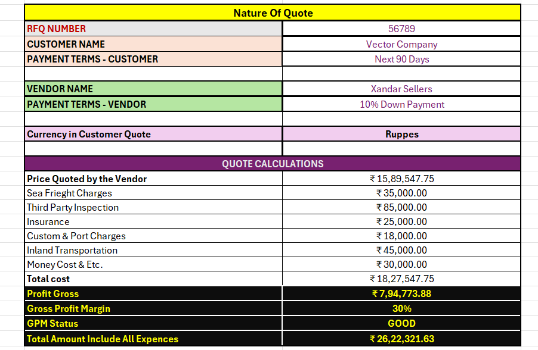
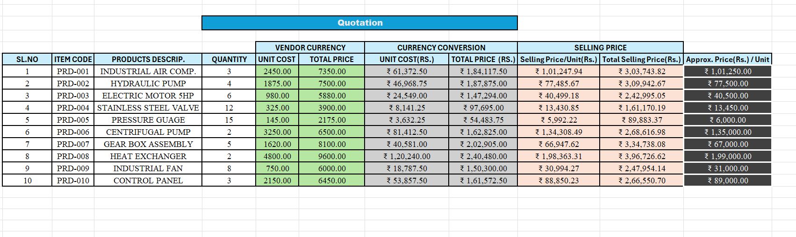
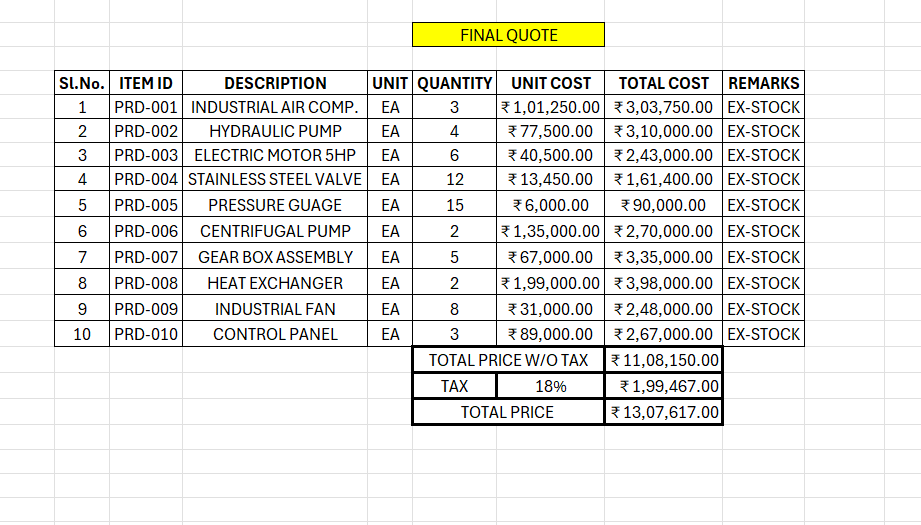

# Sales Quote & Pricing Tool

## Overview

An Excel-based sales quotation tool designed to prepare customer quotations and calculate pricing and profitability.

## Key Features

- Product and item pricing
- Quantity calculations
- Markup calculation
- Transportation and additional costs
- Gross profit calculation
- Gross Profit Margin (GPM)
- Automated quotation calculations

## Excel Skills Used

- Excel Tables
- XLOOKUP
- IF formulas
- SUM
- Data validation
- Formatting
- Data analysis

## Screenshots

### GPM Calculation

### Price Calculation

### Final Quote

