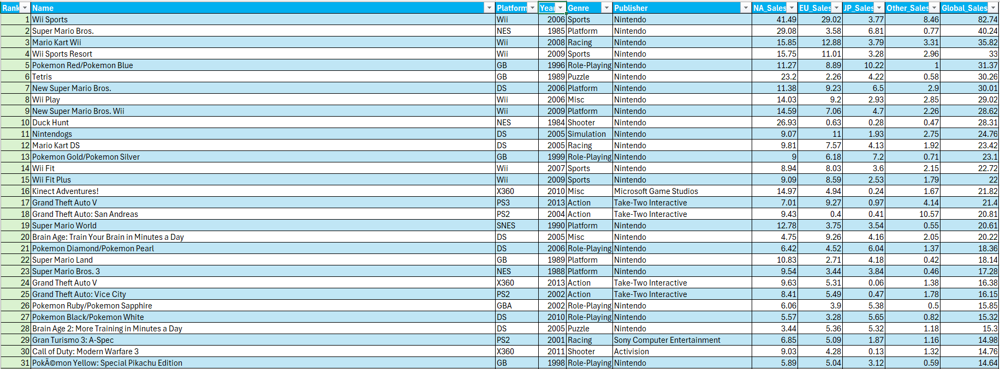
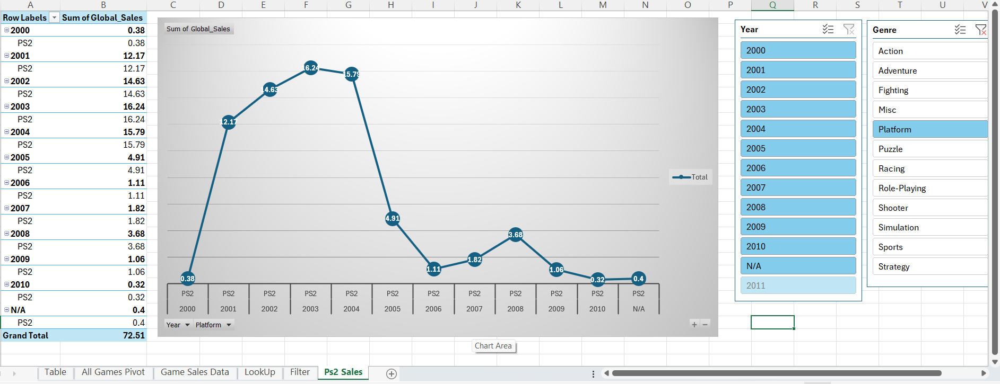
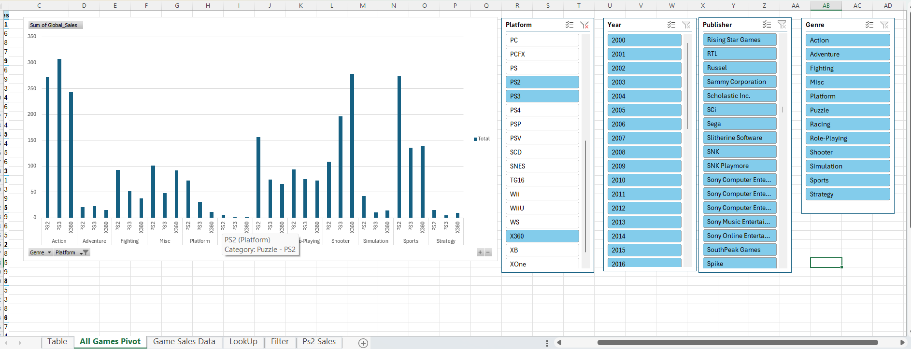

# Video Game Sales Analysis

## Overview

An Excel-based data analysis project using video game sales data to explore sales performance and identify trends.

## Key Features

- Data filtering
- Excel Tables
- XLOOKUP
- SUM calculations
- Pivot Tables
- Pivot Charts
- Slicers
- Interactive data analysis

## Excel Skills Used

- Data cleaning and organization
- Lookup functions
- Pivot Table analysis
- Data visualization
- Interactive filtering
- Excel data analysis

## Screenshots

### Sales Data

### Pivot Chart

### Interactive Slicer

